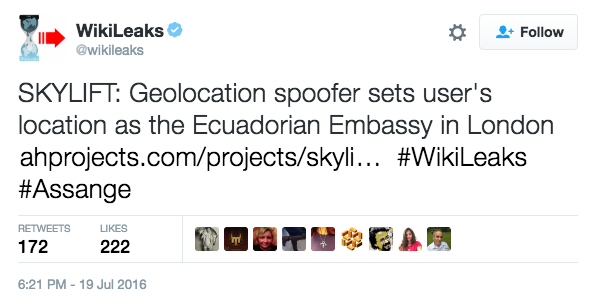
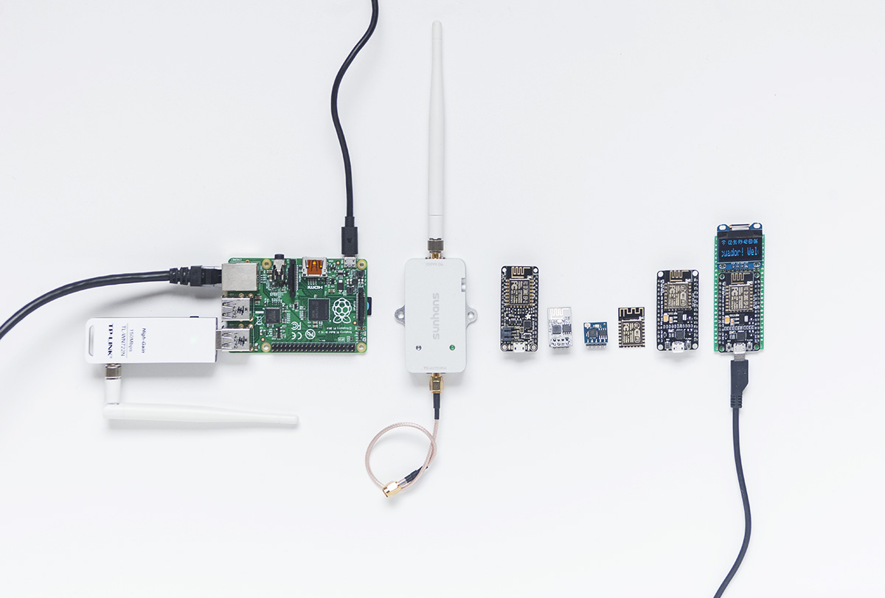

# SkyLift

SkyLift is a low-cost Wi-Fi geolocation spoofing device. It uses the ESP8266 to broadcast Wi-Fi Beacon Frames that exploit a longstanding (2008) vulnerability in Wi-Fi geolocation services. Using SkyLift you can trick your phone to appearing almost anywhere in the connected world. Locations can be collected on-site or remotely using the Wigle.net API.

*SkyLift DataPools edition with the location of Mark Zuckerberg's pool*

SkyLift has been used and tested for art exhibitions at galleries (Zoo Galerie, FACT, Eigen Lab), a museum show (La Gaîté Lyrique), and at events and performances (Transmediale, Cryptoraves, CCC).

**How Well Does it Work?**

In environments where cellular strength is poor and there are few Wi-Fi networks (less than 5) SkyLift works well, sometimes perfectly spoofing everyone's location. In dense urban environments where there are dozens of Wi-Fi networks SkyLift may have little or no ability to spoof locations. In such cases using multiple devices has shown slight improvements. Multiple devices can be used with multiple scan sources to cover larger areas.

Ideal locations are generally where Wi-Fi, GPS, and cellular signals are attenuated either by the building or by bodies. Parties and conference can work well, especially when rooms are located away from roads. Basements also work well because cellular and GPS signals are typically attenuated from metal in the floors, walls, or ceilings. Outdoor street-level areas with dozens of Wi-Fi networks and strong cellular signals tend to not work at all. Locations, such as open parks, with strong overhead GPS but weak/moderate cellular signal and minimal Wi-Fi networks sometimes works well. Basically, crowded indoor areas away from streets will yield better results. This is partially due to people (60% water) acting as Wi-Fi absorbers at 2.4GHz (the resonant frequency of H2O molecules).

## Quick Start: Arduino

A geolocation demo is provided in `arduino/skylift_demo`. To run the firmware:

- get a ESP8266 NodeMCU 12E (≈$5)
- Add `http://arduino.esp8266.com/stable/package_esp8266com_index.json` to boards manager
- Select board profile: `NodeMCU 1.0 (ESP12-E Module)`
- Open `arduino/skylift_demo` in Arduino and upload sketch
- ensure `wifi_tx_status = 1;` to enable Wi-Fi
- On a standalone  ESP8266 NodeMCU 12E you won't be able to navigate the locations or toggle the Wi-Fi On/Off but you can still change the location in the code by editing `place_idx_cur = 1;` to you preferred starting location

## Quick Start: Python

- `git clone https://github.com/adamhrv/skylift`
- `cd skylift`
- Get Wi-Fi data from Wigle: `python skylift/cli_jobs.py wigle_api --wigle_api_name [your_username] --wigle_api_key [your_api_key] --jobs data/jobs/wigle_api.csv`
- Convert networks into Arduino sketch:  `python skylift/cli_jobs.py arduino --jobs data/jobs/arduino.csv`
- open the Arduino sketch and upload to your ESP12E
- the demo sketch should start broadcasting the networks around Facebook's corporate office in Menlo Park. The data was obtained from Wigle.net
- get full list of commands by running `python skylift/cli_jobs.py`

## Setting up SkyLift

You can run SkyLift using only the minimal NodeMCU Lua ESP8266 12E device (for less than $5). The OLED, PCB, switches, and case are all optional though recommended if you want to run multiple locations. For either option there are three main parts to setting up SkyLift:

- Getting Wi-Fi scan data remotely or on-site 
- Process scanned data with Python scripts to create Arduino firmware
- Upload firmware to your ESP8266/Arduino micro-controller

Follow the guides (in progress) to setup each step:

- [Getting Data](docs/scanning.md)
- [Python environment](docs/python.md)
- [Data processing job files](docs/jobs.md)
- [Arduino](docs/arduino.md)

You can also build your own PCBs 

- [Eagle files](docs/cad.md)
- [BOM](docs/bom.md)

Or read up on more of the [research](docs/research.md) on how Beacon Frames and Wi-Fi geolocation works

## TODO

- add lasercut files for case
- add BOM for board and case
- improve board (move drill holes, update text)
- improve guides for collecting and processing data
- add more examples

### SkyLift at Exhibitions:

- Cryptorave #8 Transmediale (2019)
- Cryptorave Barcelona @ The Influencers (2018)
- [DataPools](https://ahprojects.com/datapools) with [Anastasia Kubrak](https://anastasiakubrak.com) for Tropez
- [*Dark Technology Dark Web*](spektrumberlin.de/exhibitions/detail/exhibition-10-dark-technology-dark-web.html). Spektrum. Berlin. 2017.
- [How Much of This is Fiction](http://www.fact.co.uk/projects/how-much-of-this-is-fiction.aspx). FACT. Liverpool. 2017.
- [*Lanceurs d'alerte*](https://gaite-lyrique.net/lanceurs-dalerte-0) . La Gaîté Lyrique. Paris. 2017.
- [*Welcome to Ecuador*](http://www.zoogalerie.fr/?p=2059&preview=true). Zoo Galerie. 2016.

### SkyLift Credits

Original concept developed for and in collaboration with [!Mediengruppe Bitnik](https://wwwwwwwwwwwwwwwwwwwwww.bitnik.org/) and [Surya Mattu](http://suryamattu.com) for ["Welcome to Ecuador"](http://www.zoogalerie.fr/?p=2059&preview=true) installation (2016) curated by [Aude Launay](http://launayau.de/) for Zoo Galerie. Initial technical advisement from [Julian Oliver](https://julianoliver.com), development research contributions from [Leon Eckert](http://leoneckert.com/), and beacon broadcasting code (for ESP8266) by <https://github.com/kripthor/WiFiBeaconJam>.

Development support from [Schloss Solitude Web Residency](https://schloss-post.com/skylift-low-cost-geo-location-spoofing-device/) and [tropeztropez.de](http://tropeztropez.de/)

### Disclaimer

- Use at your own risk
- This code is for security and privacy research and artistic invention in consensual environments
- After a sustained duration of broadcasting, BSSIDs may be blacklisted or even become associated with another location (this happened at [FACT Liverpool](http://www.fact.co.uk/), which could reveal your location to other users, or be used creatively for a *Bermuda Triangle* effect.
- SkyLift is not a GPS spoofing device. For 1.5GHz GPS spoofing, see [Spoof GPS location with low cost TX SDRs](http://hackaday.com/2016/07/19/pokemon-go-cheat-fools-gps-with-software-defined-radio/) or [Software-Defined GPS Signal Simulator](https://github.com/osqzss/gps-sdr-sim)
- SkyLift is currently a 2.4GHz only device
- In controlled environments where cellular signal is weak and there are few Wi-Fi networks SkyLift may work 100% but in busy urban areas with many Wi-Fi signals it may not work at all
- Check local Wi-Fi regulations before using

### Further Reading

- [Beacon Frame Overview](https://en.wikipedia.org/wiki/Beacon_frame)
- [Beacon Frame Packet](https://mrncciew.com/2014/10/08/802-11-mgmt-beacon-frame/) in more depth
- [Spoofing WiFi Geolocation services](http://www.senet-int.com/2013/12/wi-fi-geo-location/) on Hackaday
- [Don't Trust Geolocation](http://www.journaldulapin.com/2013/08/26/dont-trust-geolocation/)
- [Device-to-Identity Linking Attack Using Targeted Wi-Fi Geolocation Spoofing](https://hal.inria.fr/hal-01176842/document)

## History

SkyLift began as an experiment trying to use a Raspberry Pi with a USB Wi-Fi dongle to spoof Wi-Fi access points to reproduce the research from [PacketBrücke](https://criticalengineering.org/projects/packetbridge/) and [Spoofing WiFi Geolocation services](http://www.senet-int.com/2013/12/wi-fi-geo-location/). After much frustration using an entire Linux computer for the highly-specialized task of only broadcasting Beacon Frames, the code from <https://github.com/kripthor/WiFiBeaconJam> provided a neat opportunity to try spoofing geolocation services with the ESP8266 and it actually worked. After comparing all other ESP Wi-Fi modules the NodeMCU 12E was chosen for this project because it has the lowest entry-level price for the highest functionality (USB serial converters, on-board LED, no assembly required, mass produced / easy to source). The antennae isn't as strong as the newer ESP modules but it is possible to cut the antennae's GND/PWR traces and solder in an antennae connector if you really need a long-range amplifier.

*Earlier versions of SkyLift*

SkyLift is open source project developed and maintained by [Adam Harvey](https://ahprojects.com) 
