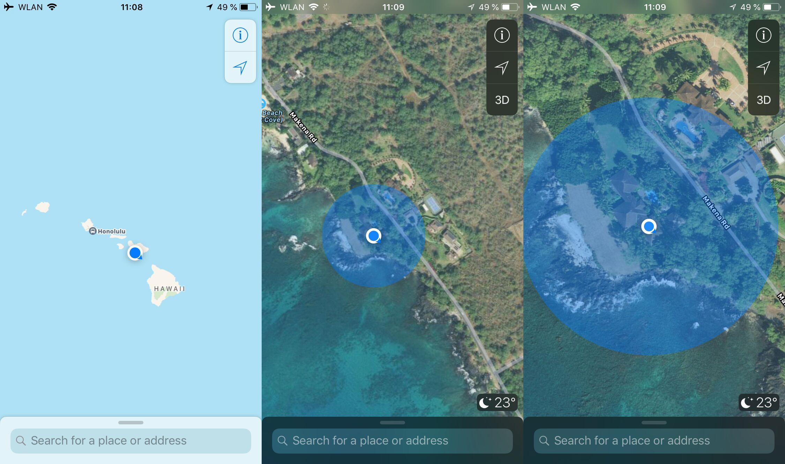

# SkyLift



SkyLift is an experimental Wi-Fi/BT geolocation spoofing device that uses the ESP8266 or ESP32 boards to broadcast Wi-Fi beacon frames or BT advertisements that emulate the wireless infrastructure from a remote/target location. The above example shows a successful georelocation to Peter Thiel's vacation house in Hawaii from the [DataPools](https://ahprojects.com/datapools) project (2018).

Mobile devices (i.e. iOS and Android) rely on this information for core geolocation services when space-based GPS signals are weak, which often occurs in urban areas or basement-like spaces.

The project has been most successful when using multiple SkyLift devices in outdoor settings positioned similar to the real (target) routers, overwhelming the existing Wi-Fi infrastructure and confusing most mobile devices. It also worked well in crowded indoor environments where bodies (which are 2/3 water) absorb Wi-Fi energy because 2.4GHz is the resonant frequency of water molecules.

However, it's still unclear what the best settings are for the Wi-Fi packet structure, what other factors affect ability to override core geolocation services, and if mobile operating systems have integrated anti-spoofing technologies. Most likely success with this code will be limited in general settings, though the low cost of prototyping hardware and potentially significant results make it a worthwhile project to explore further.


## Setup Arduino IDE

- Download Arduino IDE
- Install boards in File > Preferences: Additional boards manager URLs
- board URLs `http://arduino.esp8266.com/stable/package_esp8266com_index.json,https://raw.githubusercontent.com/espressif/arduino-esp32/gh-pages/package_esp32_index.json`
- Select board:
	- NodeMCU ESP32 is "ESP32 Dev Module"
- Set upload speed in Tools > Upload Speed to maximum 460800


## Setup Python

Tested for Linux Ubuntu 20.04

Python	
```
python -m venv venv
source venv/bin/activate
python setup.py develop
skylift
```

```
Usage: skylift [OPTIONS] COMMAND [ARGS]...

  SkyLift

Options:
  --help  Show this message and exit.

Commands:
  convert-scan   Convert WiFi/BT network can to Networks JSON
  create-sketch  Creates new Arduino sketch from template
  ```


## Usage

Convert WiFi/BT scan to networks JSON
```python
skylift convert-scan -i path/to/scan.csv -o path/to/scan.json
```

Create Arduino sketch from template
```python
skylift create-sketch	-i path/to/scan.json -o path/to/scan-arduino/
```

Customize more parameters
```python
skylift create-sketch
	-i path/to/scan.json
	-o path/to/scan-arduino/
	--max-networks 12
	--board esp32
```


## Troubleshooting

Linux
- Ensure USB serial is allowed `sudo chmod a+rw /dev/ttyUSB0`
- Ensure pyserial is installed `pip install pyserial --user`


## TODO
- [ ] add BLE adverts
- [ ] review and confirm WiFi packet structure
- [ ] add randomness to WiFi packets
- [ ] add Wigle API
- [ ] add emoji SSID support 🙃