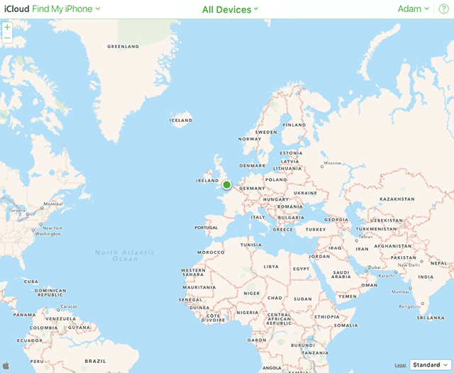

# SkyLift V0.4

Will be posted June 15

- python3
- click
- easier to use CLI parser workflow
- fix timestamp

# SkyLift V0.3 

SkyLift is a low-cost geolocation spoofing device. It currently uses the ESP8266 to broadcast WiFi Beacon Frames to exploit a longstanding (2008) vulnerability in WiFi geolocation services.

This 3rd prototype version of SkyLift was further developed during a web residency with [Akademie Schloss Solitude](https://schloss-post.com/skylift-low-cost-geo-location-spoofing-device/) & [ZKM](http://webresidencies-solitude-zkm.com/). Read an [interview](https://schloss-post.com/the-future-of-living-with-surveillance/) about the project. Or build your own with the instructions below for less than $5.

#### Updates

- May 13, 2017: Added [new scan](data/json/kiriakou.json) from John Kiriakou's (CIA whistleblower) talk at Gruener Salon in Berlin


SkyLift was originally developed in collaboration with [Surya Mattu](http://suryamattu.com) for [!Mediengruppe Bitnik's](http://wwwwwwwwwwwwwwwwwwwwww.bitnik.org/) Assange room Welcome to Ecuador!" show at Zoo Galerie in Nantes in 2016. Development for this updated version, V0.3, began in November 2016 and was finally released in May 2017 with support from a web residency at Schloss Solitude. This version makes several improvements over the initial system (SkyLift V0.1), including:

- reduced build cost from $50 to about $5
- reduced setup time for core technology from several hours to about 15 minutes
- improved user operation (simply provide USB power)
- improved performance by channel hopping
- improved packet structure (added timestamp interval byte)
- added hidden (null) SSID option "\x00"
- added utility scripts for creating custom locations
- isolated technology to a single device
- added optional OLED for display

For information on the original SkyLift (V0.1), see <https://ahprojects.com/notebook/2016/skylift-geolocation/>


SkyLift is open source project maintained by [Adam Harvey](https://ahprojects.com) that investigates security vulnerabilities and creative opportunities in consumer-facing smartphone geolocation services. 

If you're interested in obtaining a completed and ready-to-use device add yourself to my mailing list at <https://undisclosed.cc/>.


## Quick Start

- Purchase an ESP8266 NodeMCU 12 or 12E | [eBay](http://www.ebay.com/itm/NodeMcu-Lua-WIFI-Internet-Things-development-board-based-ESP8266-CP2102-module-/201542946669?hash=item2eece54f6d:g:EOIAAOSw4q9XT5mo) (cheaper) or [Amazon.com](https://www.amazon.com/HiLetgo-Version-NodeMCU-Internet-Development/dp/B010O1G1ES/) (quicker)
- `git clone https://github.com/adamhrv/skylift/`
- From "`arduino/skylift_v03_embassy"` upload the sketch `"skylift_v03_embassy.ino"`
- Ensure your smartphone's WiFi geolocation service is enbaled
- Position ESP8266 within 1 - 2m of phone (within 0.25 - 0.5m in congested WiFi area)
- Full setup and troubleshooting below

-------

## Setup

What you'll need:

- Arduino 1.6.12+
- ESP8266 NodeMCU 12 or 12E | [eBay](http://www.ebay.com/itm/NodeMcu-Lua-WIFI-Internet-Things-development-board-based-ESP8266-CP2102-module-/201542946669?hash=item2eece54f6d:g:EOIAAOSw4q9XT5mo), [Amazon.com](https://www.amazon.com/HiLetgo-Version-NodeMCU-Internet-Development/dp/B010O1G1ES/), [Adafruit Huzzah](https://www.adafruit.com/product/2821)
- USB micro cable for programming
- 5V USB battery (optional) 

With OLED display (optional):

- OLED display | [eBay](http://www.ebay.com/itm/0-96-I2C-IIC-SPI-Serial-128X64-White-OLED-LCD-LED-Display-Module-for-Arduino-/201428440360?hash=item2ee6121528:g:MOYAAOSwv0tVeD0N), [Amazon.com](https://www.amazon.com/LANMU-Serial-128X64-Display-Arduino/dp/B01G6SAWNY/)
- PCB 3x7cm (only if using OLED display) | [Amazon.com](https://www.amazon.com/Frentaly-Prototype-Circuit-Breadboard-Universal/dp/B018BD9ZJO/)
- Soldering iron 
- OLED library [Adafruit_SSD1306](https://github.com/adafruit/Adafruit_SSD1306) library
- ESP8266 libraries: "http://arduino.esp8266.com/stable/package_esp8266com_index.json"
- Wire cutters to trim the headers after soldering

Both the OLED display and ESP8266 NodeMCU can be purchased for about half-price on ebay if you're willing to wait 1-2 weeks for delivery. ESP8266 can be as low as $3.

## Test Scripts

#### Test WiFi

- Make sure you're using a recent version of Arduino (1.6.12 was used for build)
- Make sure you have the ESP8266 boards installed. In Preferences > Additional Boards add "http://arduino.esp8266.com/stable/package_esp8266com_index.json"
- From Tools > Board: select "NodeMCU 0.9 (ESP12 Module)" or the 12E
- Test with the `Arduino/test_single_beacon_frame` sketch
- Check your WiFi networks. The name *Network1* should be be visible on channel 1.


#### Test OLED Screen

- wire OLED to ESP8266 on backside of PCB
- remove black plastic on headers for lower profile
- Connect ESP8266 pin D2 -> OLED pin SDA
- Connect ESP8266 pin D3 -> OLED pin SCL 
- Connect PWR (3.3V)
- Connect GND
- Upload the sketch `Arduino/test_oled_screen`
- The text "Scrolling Text Demo 123 456" should appear scrolling across the screen


## Ecuadorian Embassy

### Test SkyLift with Ecuadorian Embassy Location

- Upload the `Arduino/skylift_v03_embassy` sketch
- Make sure you've enabled WiFi location services on your phone
- Make sure you have an active data connection (Cellular or WiFi. Your IP address does not matter)
- Open your preferred mapping application (or any app that uses your location)
- If it doesn't work, there are several reaons why. Most likely there are too many nearby routers interfering with the confidence score returned by the WiFi geolocation API.
- If there are multiple networks at -60 to -40dB it's unlikely that SkyLift will return a new geolocation

Tips for improving performance:

- Reduce number of nearby WiFi signals to less 5 networks @ less than -80dB
- Should still work with 10+ networks if their signal strength is less than -80dB
- Monitor nearby networks using the [NetSpot](https://www.netspotapp.com/) (free trial version) and move away from existing WiFi routers if possible
- Move away from windows where space-based GPS signal is stronger
- Ensure phone is close to ESP8266 (ideally 0.1 - 1m away in busy WiFi zones, 1-2m away in medium-density WiFi zones, up to 10m away in low-density WiFi zones) and far away from nearby routers.
- For distances beyond 10m you can cut the PCB trace antenna and solder a SMA connector to add a +7dB antenna or WiFi amplifier or, more simply, add multiple SkyLift devices to act as repeaters
- Metal roofs and structure will attenuate nearby WiFi signals
- Sheetrock, wood, and concrete are permeable to WiFi and will not noticeably attenuate signal
- People, comprising about 65% water, are natural WiFi absorbers (2.4GHz is the resonant frequency of water) and will function to dampen nearby WiFi signals in crowded environments, resulting in better performance for geolocation spoofing in crowded areas
- Recommended locations for optimal performance are bunkers and bars or other areas where GPS, cellular and WiFi signals are reduced. But feel free to experiment anywhere.
- The best results so far have been achieved in the basement at La Gaîté Lyrique, at concerts, and in a controlled (of course) testing environment.
- Note: **SkyLift is not a guaranteed solution**. If there are too many competing WiFi signals nearby the location service API will return a low confidence score and fallback to cellular triangulation or space-based GPS.


If you're in a indoor location with no other WiFi routers and SkyLift does not work, please file an issue report and include as many details as you can:

- [NetSpot](https://www.netspotapp.com/), or other app, scan results
- Channels used by your ESP8266
- Distance from SkyLift to smartphone
- Whether you have an active data connection on your phone
- Data connection available (LTE, 4G, 3G, EDGE, GPRS)
- iOS or Android and, if you don't mind, phone model

## Custom Locations

You can create your own SkyLift location data using iOS, OSX, or Wigle.net API. (Android and Linux processes not yet documented). 

**1A) Scan for WiFi networks on OSX**

`python utils/osx_scan_to_json.py -o data/json/my_osx_scan.json`

**1B) Scan for WiFi networks on iOS**

Use the free [AirPort Utility app](https://itunes.apple.com/us/app/airport-utility/id427276530?mt=8) and enable "Wi-Fi Scanner" in Settings > AirPort Utility. Make a WiFi scan and save it to your synced Notes or email it to yourself. Be sure there are **2 lines before the CSV data**. Example:

```
# Make your notes or add title her (saved as your_scan.txt))
SSID, BSS, RSSI, Channel, Time
"", "11:11:11:11:11:11", "-61", "44", "13:17:34"
"", "11:11:11:11:11:11", "-61", "44", "13:17:44"
"freewificonnect", "22:22:22:22:22:22", "-80", "11", "13:17:32"
"freewificonnect", "22:22:22:22:22:22", "-80", "11", "13:17:41"
```
Save your file to "data/ios/your_scan.txt" and then run:

`python utils/ios_to_json.py -i data/ios/your_scan.txt -o data/json/your_scan.json`


**1C) Use Wigle API**

Register at <https://wigle.net> to obtain an API Key and API Token (it's currently free). Results with Wigle will vary or may not work. Their data is crowdsourced and not verified or may be outdated. For the best results create your own WiFi scan on site.

`python utils/wigle_to_json.py --lat 37.484581 --lon -122.147921 --radius 3 -o data/json/wigle_test.json`

**2) Convert iOS (csv) to JSON**

`python utils/ios_to_json.py -i data/ios/your_scan.txt -o data/json/your_scan.json`

**3) Convert (any) JSON for Arduino sketch**

`python utils/json_to_arduino.py -i data/ios/your_scan.json -o data/ino/your_scan.txt`

The output text will look something like:

```
#define nn 2

char* ssids_str[nn] = {
	"74:46:A0:33:00:01",
	"74:46:A0:33:00:02"
};

byte bssids[nn][6] = {
	{0x74, 0x46, 0xA0, 0x33, 0x00, 0x12},
	{0x74, 0x46, 0xA0, 0x33, 0x00, 0x12}
};

char* ssids[nn] = {
	"wifi_ssid",
	"another_wifi_ssid"
};

#ifdef USE_SCREEN
byte channels[nn] = {6, 6};
#else
byte channels[nn] = {10, 11};
#endif


```

Then, make of a copy of "skylift_v03_embassy" and replace the existing WiFi data with your custom data.


Experimental: notice the two options for the channels. If you're using the sketch in standalone mode (w/o a screen) you may want to change the channels. For using SkyLift in a large room, it seems to work better to use multiple repeater units on random channels and the screen version on channels 1, 6, and 11. If you're only using one device stick using channels 1,6, and 11 all together has provided the best results so far.


-------

### On WiFi Geolocation Services

*Geolocation Services* is broad term for the collection of technologies used to determine a smartphone's geographic location. The four primary technologies used for geolocation services are (1) GPS, (2) cellular triangulation, (3) Bluetooth, and (4) WiFi positioning. Depending on which of these 4 signals are available, a smartphone will attempt to determine its geographic location with the highest accuracy and shortest wait time.

SkyLift makes use of an *exploit* with WiFi geolocation services that was first discovered in 2008 by Swiss researcher [Srdjan Capkun](http://www.ethlife.ethz.ch/archive_articles/080417_WiFi_location_spoofing/index_EN.html) at ETH Zurich showing. Despite their early warning in 2008, all major smartphone companies have continued to integrate WiFi as a core geolocation technology. The vulnerability still existed in 2012 when Bengt Sjölen and Gordan Savicic creatively exploited it for their 2012 project [Packetbridge](https://criticalengineering.org/projects/packetbridge/) (<- good documentation). 

The vulnerability is difficult to deal with because WiFi geolocation companies assume everyone's WiFi router, including the one inside your home, is part of a their commercial geolocation product. Whether or not this is legal or ethical should be more openly debated. 

What is certain, and was already proven in 2008, is that smartphone geolocation data can be easily falsified and should not be trusted. Yet we rely on this technology for an increasing number of critical applications. For example, the image below shows how easily I was able to trick Apple's Find my Phone service into thinking my device was at the Ecuadorian Embassy in London. (Image made with device actually in Berlin, works with Desktop or mobile device).




### Further Reading

- [Beacon Frame Overview](https://en.wikipedia.org/wiki/Beacon_frame)
- [Beacon Frame Packet](https://mrncciew.com/2014/10/08/802-11-mgmt-beacon-frame/) in more depth
- [Spoofing WiFi Geolocation services](http://www.senet-int.com/2013/12/wi-fi-geo-location/) on Hackaday
- [Don't Trust Geolocation](http://www.journaldulapin.com/2013/08/26/dont-trust-geolocation/)
- [Device-to-Identity Linking Attack Using Targeted Wi-Fi Geolocation Spoofing](https://hal.inria.fr/hal-01176842/document)
- [SkyLift V0.1 post on using MDK3 + Raspberry Pi](https://ahprojects.com/notebook/2016/skylift-geolocation/)

### Disclaimer

- Pokémon players, and others, use at your own risk
- Currently intended for research and artistic purposes only
- Check local WiFi regulations before using 
- After a sustained duration of broadcasting,  BSSIDs may be blacklisted or even become associated with another location (this happened at [FACT Liverpool](http://www.fact.co.uk/), which could reveal your location to other users, or be used creatively for a *Bermuda Triangle* effect.
- SkyLift is not a GPS spoofing device. For 1.5GHz GPS spoofing, see [Spoof GPS location with low cost TX SDRs](http://hackaday.com/2016/07/19/pokemon-go-cheat-fools-gps-with-software-defined-radio/) or [Software-Defined GPS Signal Simulator](https://github.com/osqzss/gps-sdr-sim)
- SkyLift is currently a 2.4GHz only device
- **SkyLift is not a guaranteed solution**


### SkyLift at Exhibitions:

- [*Dark Technology Dark Web*](spektrumberlin.de/exhibitions/detail/exhibition-10-dark-technology-dark-web.html). Spektrum. Berlin. 2017.
- [How Much of This is Fiction](http://www.fact.co.uk/projects/how-much-of-this-is-fiction.aspx). FACT. Liverpool. 2017.
- [*Lanceurs d'alerte*](https://gaite-lyrique.net/lanceurs-dalerte-0) . La Gaîté Lyrique. Paris. 2017.
- [*Welcome to Ecuador](http://www.zoogalerie.fr/?p=2059&preview=true). Zoo Galerie. 2016.
I
### SkyLift Credits:

- Original concept developed in collaboration with [!Mediengruppe Bitnik](https://wwwwwwwwwwwwwwwwwwwwww.bitnik.org/) (DE)
- SkyLift V0.1 developed in collaboration with [Surya Mattu](http://suryamattu.com) (US) 
- Technical advisement from [Julian Oliver](https://julianoliver.com) (DE)
- Research assistance and Python development contributions: [Leon Eckert](http://leoneckert.com/) (US/DE)
- ["Welcome to Ecuador"](http://www.zoogalerie.fr/?p=2059&preview=true) installation (2016) curated by [Aude Launay](http://launayau.de/) for Zoo Galerie
- ESP8266 proof of concept Beacon Frame code by <https://github.com/kripthor/WiFiBeaconJam>
- [Schloss Solitude Web Residency](https://schloss-post.com/skylift-low-cost-geo-location-spoofing-device/)
